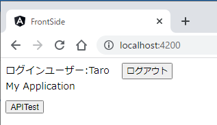

# NestJS Angular JWT Authentication Sample

## 概要
サーバサイド：NestJS、フロントサイド:AngularによるJWT認証サンプルです。  
ユーザー情報はメモリ上の配列で保持しています。  
ユーザ名とパスワードによる認証です。  

## 目的  
当初はNestJS、Angularによる認証について理解を深めるために作成し始めました。  
今後は認証を必要とするサービスを作成する際にコピーペーストで活用できることを望んでいます。  
何方かのアプリ開発の助けになることがあれば、とてもうれしいことです。  

## 環境、使用フレームワーク  

| フレームワーク | バージョン |  
|:-|:-:|
|Node  | 16 |
|NestJS  | 9 |
|Angular  | 14 |

## ディレクトリ構成
ルートとfront-sideディレクトリ、server-sideディレクトリの3か所にpackage.jsonがあります。  
ルートにnestjs/cli、angular/cliをインストールします。  
front-sideディレクトリにAngularのコード、server-sideディレクトリにNestJSのコードを配置しています。  
```
(root)
 ├/front-side  //Angular
 │  ├/src
 │  │  ├...
 │  ├package.json
 │  ├...
 │
 ├/server-side  //NestJs
 │  ├/src
 │  │  ├...
 │  ├package.json
 │  ├...
 ├pacage.json  //nestjs/cli、angular-cli
 ├...
```  

## 環境構築方法、使用方法  
当リポジトリを展開した場所で以下を実行します。  
```bash
# ルートディレクトリ
npm install

# server-sideディレクトリに移動して実行
npm install 
# NestJSのサーバサイドのプログラムを実行
npm run start:dev

# front-sideディレクトリに移動して実行
npm install
# Angularのフロントサイドをポート4200の仮サーバーで実行
npm run serve
```
### モックデータのユーザー一覧  
下記内容は`/server-side/src/users/users.service.ts`にコーディングしています。
| ユーザー名 | パスワード |
|:-|:-|
|Taro | pass1 |
|Hanako | pass2 |  

### 検証WebAPI  
URL:`lcoalhost:3000/api/hoge`に単に'hoge'という文字列を返すテスト用APIを準備しました。  
認証済の状態でリクエストすると文字列を返し、未認証状態でリクエストするとNestJsのガードが働き`UnAuthorization`エラーをスローします。  

## 動作確認  
### フロントサイドのルーティング  
```
http://localhost:4200        #メイン画面
  ├/auth/login               #ログイン画面
  └/user-registration        #新規ユーザー登録画面
```
ブラウザで`http://localhost:4200`にアクセスします。  
まだ認証されていない状態ですので、AnguarのGuard機能が働き`http://localhost:4200/auth/login`にリダイレクトします。  
`APITest`ボタンは本来はここにあるべきボタンではありませんが、未認証状態でのWebAPIへのリクエストを検証するために配置しました。  
  
ログインエラー時、サーバから返されたエラーを表示します。  
  
未認証状態で`APITest`ボタンをクリックしWebAPIにリクエストするとエラーになります。  
  
ユーザー名、パスワードを入力し、認証が通ると、`http://localhost:4200`に移動します。  
  
設定した有効期間、ログイン状態を保持します。リロードしても、このメイン画面を表示します。  
有効期間内に再アクセス時、ログイン有効期間を再設定します。  
有効期間の設定箇所は以下です。  
```typescript:/server-side/src/auth/auth.modules.ts
...
@Module({
  imports: [
    UsersModule, 
    PassportModule, 
    JwtModule.register({
      secret: jwtConstants.secret, 
      signOptions: { expiresIn: '60s' } //←有効期間の設定箇所 60秒に設定
    })
  ], 
  ...
```
認証済の状態で`APITest`ボタンをクリックしWebAPIにリクエストすると、レスポンスを取得します。  
下図の'hoge'はWebAPIから取得した値を表示しています。  
  
新規ユーザ登録は`http://localhost:4200/user-registration`で行います。  
  
エラー時、サーバから返されたエラーを表示します。  
  

## **注意**  
JWTのハッシュキーを`/serer-side/src/constsnts.ts`でハードコーディングし、`/server-side/auth/auth.module.ts`で参照しています。  
本番用に開発される際は、公開しないように注意してください。  
> WARNING
この鍵を公開するべきではない。ここではコードが何をしているかを明確にする為公開しているが、実運用システムではsecrets valut、環境変数、設定サービスなどの適切な手段を用いて鍵を保護しなければならない。  
([security-authentication｜NestJS 公式ドキュメントver7日本語訳](https://zenn.dev/kisihara_c/books/nest-officialdoc-jp/viewer/security-authentication)より引用)

```typescript:/server-side/src/constants.ts
export const jwtConstants = {
  secret: 'secret key' //本番環境では注意
};
```
```typescript:/server-side/src/auth/auth.modules.ts
...
@Module({
  imports: [
    UsersModule, 
    PassportModule, 
    JwtModule.register({
      secret: jwtConstants.secret, //本番環境では注意
      signOptions: { expiresIn: '60s' }
    })
  ], 
  ...
```

## 参考にさせて頂いたサイト  
[security-authentication｜NestJS 公式ドキュメントver7日本語訳](https://zenn.dev/kisihara_c/books/nest-officialdoc-jp/viewer/security-authentication)  
[Documentation \| NestJS - A progressive Node.js framework](https://docs.nestjs.com/security/authentication)  
[GitHub - auth0/angular2-jwt: Helper library for handling JWTs in Angular 2+ apps](https://github.com/auth0/angular2-jwt)  
[Morioh \ 【初心者向け】Angular 12 JWT認証](https://morioh.com/p/1070ff189846)  

以上です。